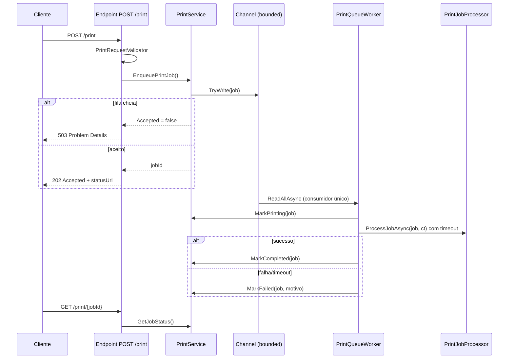

# Arquitetura do PrintManagerAPI

## Visão geral

Monólito modular em .NET 8 Minimal API, com três responsabilidades bem separadas:

1. **Descoberta de impressoras** (`PrinterDiscoveryService`) — única classe que fala com `System.Drawing.Printing.PrinterSettings`.
2. **Gestão da fila** (`PrintService`) — enfileiramento, capacidade, rastreamento de status.
3. **Processamento** (`PrintQueueWorker` + `PrintJobProcessor`) — consumo serial da fila e renderização/impressão via GDI+.

## O núcleo: fila com consumidor único

### Por que Channel + BackgroundService (e não flag + Task.Run)

A versão anterior disparava `Task.Run(ProcessQueueAsync)` a cada enqueue e usava uma flag
`volatile bool _isPrinting` como exclusão mútua. Isso tinha duas race conditions reais:

1. **Check-then-act não atômico** — dois `Task.Run` simultâneos podiam ambos ler
   `_isPrinting == false` antes de qualquer um setar a flag, resultando em dois loops
   de processamento concorrentes (violando a regra de um job por vez).
2. **Lost wakeup** — um job enfileirado entre o último `TryDequeue` do worker e o
   `_isPrinting = false` ficava preso na fila até o próximo enqueue.

Com um `Channel` bounded e **um único consumidor de vida longa**, as duas classes de
erro desaparecem por construção: não há flag para disputar e o worker nunca "termina"
enquanto a aplicação vive. Os testes em `PrintQueueWorkerTests` cobrem exatamente
esses dois cenários como regressão.

### Decisões e trade-offs

| Decisão | Motivo | Custo aceito |
|---|---|---|
| Fila em memória (Channel) | Escopo do desafio; simplicidade | Jobs pendentes se perdem em restart |
| Bounded channel (padrão 100) | Backpressure explícito; evita DoS por memória | Cliente precisa tratar 503 |
| Consumidor único | Garantia estrutural de FIFO/serialização | Não paraleliza para múltiplas impressoras |
| Timeout com `WaitAsync` | Fila não trava com driver lento | Thread do driver pode continuar ocupada (limitação conhecida) |
| Singleton para os serviços | Estado da fila é do processo | Sem scale-out horizontal |
| API key opcional + rate limit | Proteção mínima para uso em LAN | Não substitui autenticação real por usuário |

### O que deliberadamente NÃO foi usado

- **CQRS, MediatR, Event Sourcing, Outbox** — não há múltiplos modelos de leitura/escrita
  nem integração entre serviços que justifiquem o custo.
- **Microsserviços / Kubernetes** — sistema de escopo único, acoplado ao hardware local.
- **Repository/Unit of Work** — não há banco de dados.

## Camadas

- `API/Interfaces` — contratos (`IPrintService`, `IPrintJobProcessor`, `IPrinterDiscoveryService`).
- `API/Models` — DTOs de request/response e estado (`PrintJob`, `PrintSettings`, `PrintJobStatusInfo`, `QueueStatus`, `EnqueueResult`).
- `API/Services` — implementações; `PrintQueueWorker` é o hosted service consumidor.
- `API/Validation` — validação de entrada na borda (limites de texto, fonte, cor).
- `Configuration` — DI (`ServiceConfiguration`), endpoints (`EndpointConfiguration`),
  opções tipadas e validadas (`PrintQueueOptions`), `PrinterHealthCheck`, `ApiKeyMiddleware`.

## Tratamento de erros

- Erros de validação → `400` com `ValidationProblem` (erros por campo).
- Impressora/job inexistente → `404` Problem Details.
- Fila cheia → `503` Problem Details.
- Rate limit → `429`.
- Sem chave de API (quando configurada) → `401`.
- Exceções não tratadas → `500` Problem Details via `UseExceptionHandler`
  (sem stack trace para o cliente).

## Observabilidade

- Logs estruturados via `ILogger` (templates com `JobId`, `PrinterName`).
- `/health` (readiness, consulta o spooler) e `/health/live` (liveness).
- Evolução planejada: OpenTelemetry (traces + métricas) — ver roadmap na auditoria.
